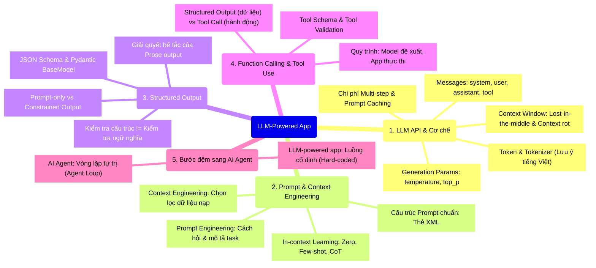
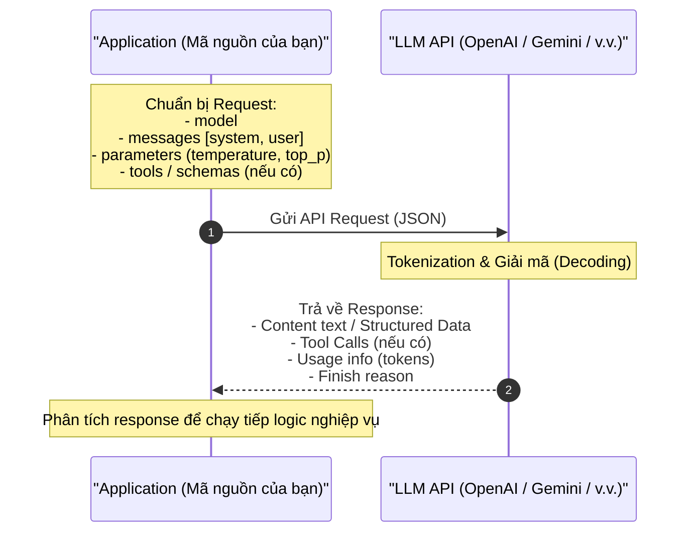
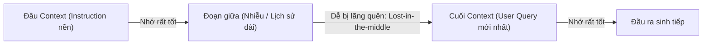
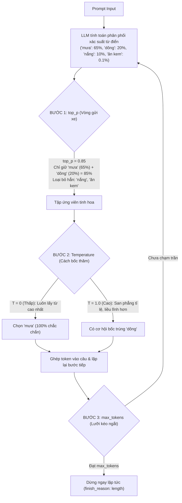
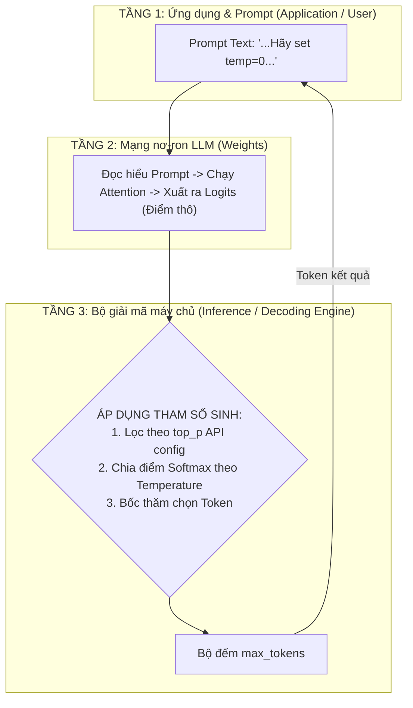
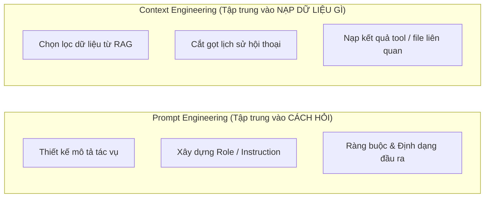
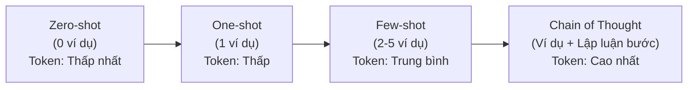
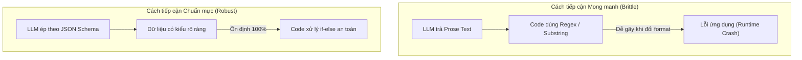
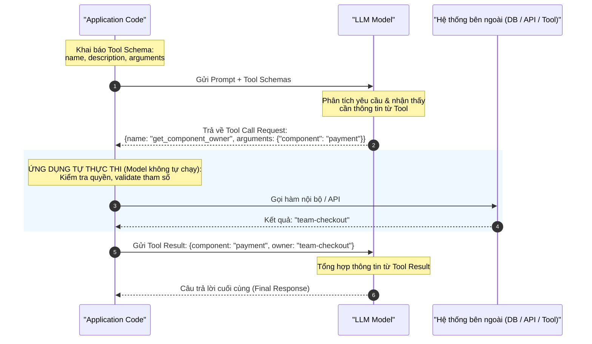
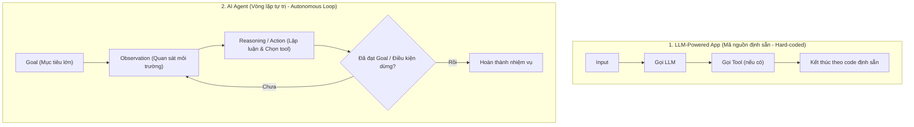

# Buổi 02: Các nguyên lý cơ bản của LLM-Powered App

Tài liệu ghi chép và diễn giải chi tiết toàn bộ phần lý thuyết bài giảng Buổi 02. Tài liệu này giúp định hình tư duy lập trình khi chuyển từ việc "chat với LLM" sang việc "xây dựng hệ sinh thái phần mềm tích hợp LLM".

---

## 🗺️ Bản đồ tổng quan bài giảng (Mindmap)



---

## PHẦN 1: LLM-POWERED APP & CƠ CHẾ TƯƠNG TÁC API

### 1. Bản chất của một LLM-Powered App
Một **LLM-powered app** là phần mềm trong đó mã nguồn ứng dụng (Application code) đóng vai trò điều phối:
1. Gửi dữ liệu đầu vào tới LLM API dưới dạng request có cấu trúc.
2. Nhận kết quả phản hồi từ LLM và đưa kết quả này vào luồng logic (`if-else`, truy vấn DB, gọi service tiếp theo) của phần mềm.

#### Bế tắc của văn bản tự nhiên (Prose Output):
* **Con người:** Đọc hiểu tốt các câu chữ tự nhiên như: *"Lỗi này có vẻ nghiêm trọng, có thể là P0 hoặc P1 tùy mức độ..."*.
* **Phần mềm:** Không thể điều kiện hóa (`if/else`) bằng câu chữ mơ hồ. Nếu dùng Regex hay tìm chuỗi con `if "P0" in response:` thì hệ thống sẽ rất mong manh, dễ vỡ khi văn phong model thay đổi. Phần mềm bắt buộc phải nhận được dữ liệu có cấu trúc ổn định.

---

### 2. Chu trình tương tác với LLM API



---

### 3. Phân định vai trò trong `messages`

Cấu trúc hội thoại chuẩn mực gửi lên model gồm danh sách các đối tượng message với vai trò rõ ràng:

| Role (Vai trò) | Mục đích & Trách nhiệm |
| :--- | :--- |
| **`system` / `developer`** | Thiết lập chỉ thị nền tảng: quy định vai trò, nguyên tắc làm việc, giọng điệu, các ràng buộc cấm vi phạm. Model sẽ bám theo chỉ thị này suốt phiên làm việc. |
| **`user`** | Đầu vào hoặc yêu cầu cụ thể từ người dùng hoặc do ứng dụng nạp vào ở lượt gọi hiện tại. |
| **`assistant`** | Phản hồi trước đó của chính LLM trong cùng phiên (được ứng dụng lưu lại và gửi kèm để duy trì ngữ cảnh nhiều lượt - multi-turn). |
| **`tool`** | Kết quả thực thi thực tế của công cụ được gửi ngược lại cho model sau khi ứng dụng chạy xong hàm mà model yêu cầu. |

---

### 4. Token, Context Window và Chi phí

#### A. Token & Tokenizer
* LLM xử lý ngôn ngữ dưới dạng các mảnh từ gọi là **Token**, không phải ký tự hay từ nguyên vẹn.
* **Lưu ý đặc biệt về Tiếng Việt:** Do các bộ tokenizer phổ biến (như `cl100k_base`, `o200k_base`) được tối ưu cho tiếng Anh, văn bản tiếng Việt thường bị băm thành nhiều mảnh nhỏ hơn, dẫn tới việc tiêu tốn **1.6× đến 2.4× lượng token** so với nội dung tiếng Anh tương đương.
* *Tuyệt đối không dùng `len(text.split())` để ước lượng chi phí token.*

#### B. Context Window & Các hiện tượng suy giảm hiệu năng
Context Window là tổng lượng token tối đa mà mô hình có thể tiếp nhận và sinh ra trong một lần gọi duy nhất.



* **Lost in the middle:** Thông tin quan trọng nằm ở đoạn giữa của một context dài có xác suất bị mô hình bỏ sót cao hơn thông tin nằm ở ngay đầu hoặc cuối context.
* **Context rot:** Khi context bị nhồi nhét quá dài và chứa nhiều thông tin rác, khả năng suy luận logic của model bị giảm sút rõ rệt dù vẫn chưa chạm trần kỹ thuật của context window.

#### C. Chi phí trong quy trình nhiều bước (Multi-step)
Trong một task chạy qua 10 bước:
* Mỗi bước gửi lại 3.000 token nền + 500 token lịch sử mới.
* **Chi phí tính tiền:** Là tổng lượng token của **cả 10 lần gọi cộng lại**, chứ không phải chỉ là token của bước thứ 10.
* **Prompt Caching:** Kỹ thuật của nhà cung cấp API lưu lại bộ nhớ đệm cho phần prefix giống nhau giữa các lần gọi. Caching giúp **giảm tiền và độ trễ**, nhưng **không làm model thông minh hơn**.

---

### 5. Generation Parameters (Tham số điều khiển quá trình sinh)

#### A. Bản chất toán học: LLM chọn từ như thế nào?
Sau khi tiếp nhận câu prompt, tại mỗi bước sinh từ tiếp theo, LLM **không chọn từ ngay lập tức**. Tầng cuối cùng của mô hình sẽ tính toán một bảng phân phối xác suất cho toàn bộ từ điển (khoảng 100.000 token).
*Ví dụ:* Sau câu *"Hôm nay trời nhiều mây, dự báo chiều nay có thể sẽ..."*, xác suất tính được là:
* `"mưa"`: **65%**
* `"dông"`: **20%**
* `"nắng"`: **10%**
* `"gió nhẹ"`: **4.9%**
* `"ăn kem"`: **0.1%**

👉 **Các tham số sinh (Generation Parameters) chính là các "núm vặn" để thay đổi luật chơi của trò bốc thăm token này.**



---

#### B. `temperature` (Nhiệt độ) – Độ "phiêu lưu" khi bốc thăm
`temperature` ($T$) can thiệp vào hàm Softmax để **phóng đại** hoặc **san phẳng** sự chênh lệch xác suất giữa các từ:

$$P(\text{token}_i) = \frac{e^{z_i / T}}{\sum_j e^{z_j / T}}$$

*Bảng minh họa sự biến thiên xác suất theo nhiệt độ:*

| Token ứng viên | Xác suất gốc | Khi $T = 0$ (Cực lạnh) | Khi $T = 0.7$ (Cân bằng) | Khi $T = 1.5$ (Cực nóng) |
| :--- | :---: | :---: | :---: | :---: |
| `"mưa"` | 65% | **100%** | 55% | 30% |
| `"dông"` | 20% | 0% | 25% | 25% |
| `"nắng"` | 10% | 0% | 13% | 22% |
| `"gió nhẹ"` | 4.9% | 0% | 6.9% | 18% |
| `"ăn kem"` | 0.1% | 0% | 0.1% | 5% |

* **Khi $T = 0$ (Greedy Decoding / Xác định hoàn toàn):**
  * Không còn bốc thăm ngẫu nhiên. Token có xác suất cao nhất luôn luôn thắng ($100\%$).
  * **Đặc tính:** Chạy 100 lần thì cả 100 lần đều trả về **cùng một kết quả giống hệt nhau từng ký tự**.
  * **Ứng dụng:** Viết mã nguồn (Coding), truy vấn SQL, giải Toán, phân loại sự cố (Issue Triage), sinh JSON theo Schema.
* **Khi $T$ cao ($0.8 - 1.2$):**
  * Nhiệt độ cao làm phẳng đồ thị xác suất, thu hẹp khoảng cách giữa token dẫn đầu và token xếp sau. Mô hình dễ bốc trúng các từ bất ngờ, độc đáo hơn.
  * **Đặc tính:** Câu văn phong phú, sáng tạo, nhưng nếu đặt quá cao ($> 1.5$) thì mô hình sẽ nói lảm nhảm, loạn ngữ hoặc sinh ảo giác (hallucination).
  * **Ứng dụng:** Sáng tác văn học, làm thơ, brainstorm ý tưởng chiến dịch marketing.

---

#### C. `top_p` (Nucleus Sampling) – "Bộ lọc vòng gửi xe"
Nếu `temperature` quyết định *cách thức bốc thăm*, thì `top_p` là *luật loại trừ ứng viên trước khi bốc thăm*.

* **Vấn đề đặt ra:** Trong từ điển có hàng ngàn token vô nghĩa hoặc phản cảm (xác suất chỉ $0.001\%$). Dù $T$ có cao thế nào, ta cũng không muốn model vô tình bốc trúng các từ rác này.
* **Cơ chế:** Sắp xếp các token từ xác suất cao xuống thấp và tính tổng tích lũy. Khi tổng vừa chạm ngưỡng $p$, **loại bỏ hoàn toàn tất cả các token còn lại**.
  * *Ví dụ:* Với `top_p = 0.85`, do `"mưa"` ($65\%$) + `"dông"` ($20\%$) = $85\%$, model sẽ loại bỏ toàn bộ `"nắng"`, `"gió nhẹ"`, `"ăn kem"`. Việc bốc thăm chỉ diễn ra giữa `"mưa"` và `"dông"`.
* **Lời khuyên thực tế:** **Chỉ nên điều chỉnh 1 trong 2** (`temperature` hoặc `top_p`), giữ tham số còn lại ở mặc định để tránh hành vi bất thường.

---

#### D. `max_tokens` – "Lưỡi kéo" giới hạn độ dài
* ❌ **Hiểu lầm phổ biến:** Nghĩ rằng đặt `max_tokens = 50` là mô hình sẽ "tóm tắt ngắn gọn câu trả lời trong phạm vi 50 token".
* ✅ **Bản chất thực tế:** Mô hình **không hề biết trước** nó bị giới hạn 50 token và vẫn sinh câu dài dòng như bình thường. Cứ mỗi token sinh ra, bộ đếm giảm đi 1. Đúng đến token thứ 50, API **cắt ngang lập tức** (dù câu đang dang dở).
* Khi bị ngắt cưỡng bức, API trả về trạng thái: `finish_reason: "length"` (thay vì `finish_reason: "stop"` khi kết thúc tự nhiên).

---

#### E. Bảng tra cứu thiết lập tham số chuẩn cho dự án thực tế

| Nhiệm vụ trong hệ thống phần mềm | `temperature` | `top_p` | Lý do kỹ thuật |
| :--- | :---: | :---: | :--- |
| **Phân loại sự cố (Issue Triage P0-P3)** | `0.0` | `1.0` | Đòi hỏi tính nhất quán tuyệt đối, không được suy diễn ngẫu nhiên. |
| **Xuất JSON Schema / Pydantic** | `0.0` | `1.0` | Triệt tiêu nguy cơ sai cú pháp JSON và không bịa thêm trường lạ. |
| **Hỏi đáp nghiệp vụ nội bộ (RAG / Q&A)** | `0.2 - 0.3` | `1.0` | Câu văn tự nhiên, mượt mà nhưng vẫn bám sát 100% tài liệu gốc. |
| **Tóm tắt văn bản (Summarization)** | `0.3 - 0.5` | `1.0` | Đủ linh hoạt để nối câu trôi chảy mà không làm biến đổi ngữ nghĩa. |
| **Brainstorm / Sáng tạo nội dung** | `0.8 - 1.0` | `0.9` | Cần văn phong đa dạng, giàu hình ảnh và ý tưởng bất ngờ. |

---

#### F. Có thể điều khiển `temperature` và `top_p` trực tiếp trong Prompt không?
> **Câu trả lời dứt khoát về mặt kỹ thuật:** **KHÔNG THỂ.**  
> Nếu bạn viết vào prompt: *"Hãy tự set temperature = 0 và top_p = 0.85 để trả lời tôi nhé!"*, mô hình **hoàn toàn không làm được**.



##### 1. Tại sao Prompt không điều khiển được tham số sinh?
* `temperature` và `top_p` **không nằm trong trọng số (weights)** của mô hình, mà nằm ở **Tầng 3 (Inference Engine)** bên ngoài mô hình.
* Inference Engine chỉ nhận tham số từ **cấu hình API Request (JSON payload)**, nó không "đọc nội dung văn bản" của prompt để tự cấu hình lại server.
* Khi bạn yêu cầu chỉnh tham số trong prompt, mô hình chỉ xem đó là văn bản thông thường và có thể lịch sự đáp lại: *"Vâng, tôi sẽ trả lời chính xác nhất..."*, nhưng bộ giải mã máy chủ vẫn bốc thăm theo tham số cấu hình của API.

##### 2. Ba nơi bạn thực sự nắm quyền kiểm soát:
1. **Trong mã nguồn gọi API (Application Code):**
   * *Google GenAI SDK:* `config=types.GenerateContentConfig(temperature=0.1, top_p=0.85)`
   * *OpenAI SDK:* `client.chat.completions.create(..., temperature=0.0, top_p=0.9)`
   * *LangChain:* `ChatOpenAI(temperature=0.0)`
2. **Trên giao diện Web / Playground:** Kéo các thanh trượt (Sliders) ở cột System Settings trên Google AI Studio hoặc OpenAI Playground.
3. **Trên Local LLM (Ollama, vLLM):** Khai báo trong `Modelfile`:
   ```dockerfile
   FROM llama3
   PARAMETER temperature 0.1
   PARAMETER top_p 0.85
   ```

##### 3. Kỹ thuật Prompt Engineering để "mô phỏng" hiệu ứng của Temperature:
Mặc dù không can thiệp được công thức toán học, bạn có thể dùng câu lệnh ép buộc hành vi (Behavioral constraints):
* **Mô phỏng $T \to 0$ (Chính xác, chống ảo giác):**
  > *"Chỉ sử dụng DUY NHẤT các thông tin có trong ngữ cảnh trên. Tuyệt đối KHÔNG suy đoán, không sáng tạo thêm. Nếu thông tin không được đề cập, bắt buộc phải trả lời: 'Không có dữ liệu'. Tuân thủ nghiêm ngặt schema đầu ra."*
* **Mô phỏng $T \to 1$ (Sáng tạo, đa dạng):**
  > *"Hãy đóng vai một nhà tư tưởng độc lập. Hãy đưa ra 5 góc nhìn hoàn toàn trái ngược với các định kiến thông thường. Sử dụng nhiều phép ẩn dụ táo bạo, mở rộng liên tưởng sang các lĩnh vực nghệ thuật và triết học."*

---

## PHẦN 2: PROMPT & CONTEXT ENGINEERING

### 1. Phân biệt hai khái niệm cốt lõi



> **Nguyên tắc vàng:** Đưa đúng và đủ thông tin quan trọng luôn hiệu quả hơn việc ném toàn bộ dữ liệu vào context.

---

### 2. Cấu trúc chuẩn của một Prompt (Sử dụng thẻ XML)
Để tránh việc model nhầm lẫn giữa lời chỉ thị của hệ thống và dữ liệu thô do người dùng nhập, bài giảng khuyến nghị cấu trúc hóa prompt bằng các thẻ XML:

```xml
<role>
Bạn là kỹ sư phụ trách phân loại sự cố hệ thống (Issue Triage).
</role>

<context>
Hệ thống API thanh toán trực tuyến đang chạy trên môi trường Production.
</context>

<task>
Phân loại mức độ nghiêm trọng của sự cố theo 4 cấp độ: P0, P1, P2, P3.
</task>

<constraints>
- Nếu dữ liệu trong issue không đủ kết luận, đánh dấu status là "insufficient_data".
- Tuyệt đối không tự suy đoán ngoài các chi tiết được cung cấp.
</constraints>

<input>
{issue_text}
</input>

<output>
Trả về mã severity (P0-P3) kèm theo lý do ngắn gọn (tối đa 2 câu).
</output>
```

---

### 3. In-context Learning & Chain of Thought (CoT)



#### A. Few-shot Prompting & Đánh đổi (Trade-offs)
* **Bản chất:** Đưa vào prompt 2–5 cặp mẫu `(Input mẫu -> Output mẫu)` để model bắt chước quy luật phân loại và cấu trúc trả về mà không cần giải thích trừu tượng.
* **Đánh đổi:**
  * **Hữu ích khi:** Áp dụng hệ thống phân loại riêng của doanh nghiệp; minh họa các trường hợp ranh giới mập mờ (boundary cases) khó định nghĩa bằng lời.
  * **Phản tác dụng khi:** Làm phình to context window; gây thiên lệch nhãn (Bias - ví dụ đưa nhiều mẫu P0 thì model sẽ thiên về đoán P0); dùng ví dụ để ép JSON thay vì dùng Schema chuẩn.

#### B. Chain of Thought (CoT) - Kỹ thuật suy luận từng bước
* **Vấn đề của Zero-shot:** Khi gặp bài toán tính toán hoặc suy luận nhiều bước, nếu bắt LLM trả ngay đáp án cuối cùng, nó sẽ "đoán mò" token và tính nhẩm sai.
* **Cơ chế CoT:** Yêu cầu mô hình viết ra các bước trung gian trước. Đoạn văn bản suy luận này đóng vai trò như một **bảng nháp (scratchpad)** trong context để các token tính toán tiếp theo bám vào.
* **Xu hướng Reasoning Models:** Các dòng mô hình lý luận mới (OpenAI o1/o3, Gemini Thinking) đã tích hợp sẵn cơ chế suy luận ngầm bên trong, giảm bớt nhu cầu phải viết các câu thần chú thủ công như *"Hãy suy nghĩ từng bước một"*.

---

## PHẦN 3: STRUCTURED OUTPUT (ĐẦU RA CÓ CẤU TRÚC)

Đây là điều kiện tiên quyết để tích hợp LLM vào phần mềm tự động hóa.



---

### 1. JSON Schema & Pydantic trong Python

Để định nghĩa cấu trúc dữ liệu mong muốn, ta sử dụng **JSON Schema** hoặc khai báo thông qua **Pydantic**:

```python
from typing import Literal
from pydantic import BaseModel, Field

class IssueTriage(BaseModel):
    status: Literal["classified", "insufficient_data", "out_of_scope"]
    severity: Literal["P0", "P1", "P2", "P3"] | None = None
    component: str | None = None
    needs_urgent_response: bool = False
    reason: str = Field(description="Lý do ngắn gọn dựa trên dữ liệu issue")
```

#### Các từ khóa then chốt trong JSON Schema:
* **`properties`:** Danh sách và kiểu dữ liệu của các trường.
* **`required`:** Danh sách trường bắt buộc phải có, model không được phép bỏ sót.
* **`enum`:** Giới hạn tập giá trị hợp lệ (chống việc model tự tạo giá trị lạ).
* **`additionalProperties: false`:** Nghiêm cấm model tự ý sinh thêm trường ngoài schema.

---

### 2. Prompt-only vs Constrained Output (Ràng buộc cấp API)

* **Prompt-only:** Chỉ viết trong prompt: *"Hãy trả lời bằng JSON theo schema..."*.
  * **Rủi ro:** Model vẫn có thể tự ý thêm lời chào, bọc code fence ````json ... ````, thiếu trường, hoặc sinh sai kiểu dữ liệu.
* **Constrained Output:** Gửi schema trực tiếp vào tham số API (như `response_format` / `response_schema`).
  * **Cơ chế:** Nhà cung cấp can thiệp vào thuật toán lấy mẫu token (Grammar-guided decoding). Model bị chặn đứng về mặt toán học, **chỉ có thể sinh ra các token hợp lệ theo schema**.

> ⚠️ **Lưu ý cốt tử của bài giảng:**  
> **Schema chỉ kiểm tra tính hợp lệ về mặt CẤU TRÚC, không kiểm tra được tính đúng đắn về mặt NGỮ NGHĨA.**  
> *(Ví dụ: Model trả về `{"severity": "P0"}` là hoàn toàn hợp lệ theo schema, nhưng trên thực tế lỗi đó có đúng là P0 hay không thì schema không thể xác nhận được. Đó là lý do hệ thống vẫn cần validation nghiệp vụ ở phía Application).*

---

## PHẦN 4: FUNCTION CALLING & TOOL USE

Nếu **Structured Output** là việc model **trả về dữ liệu**, thì **Function Calling** là việc model **đề xuất một hành động có cấu trúc**.



---

### 3 nguyên tắc bất di bất dịch của Tool Use:

1. **Model KHÔNG BAO GIỜ tự chạy code:** Model không thể truy cập database, không tự gọi REST API hay thực thi bash shell. Model chỉ tạo ra một đối tượng JSON mô tả lời đề nghị gọi hàm.
2. **Application nắm toàn quyền thực thi:** Mã nguồn ứng dụng của bạn là bên duy nhất quyết định có thực thi tool đó hay không, có quyền kiểm tra tính hợp lệ và áp đặt giới hạn an toàn (security/permissions).
3. **Đúng kiểu dữ liệu $\neq$ Đúng ý nghĩa:** Tham số truyền vào có thể đúng kiểu `string` (ví dụ `component: "payment-api-v2"`), nhưng component này có thể hoàn toàn không tồn tại trong hệ thống. Ứng dụng phải tự xử lý các trường hợp ngoại lệ này.

---

## PHẦN 5: BƯỚC CHUYỂN TIẾP SANG AI AGENT

### So sánh LLM-Powered App và AI Agent



* **LLM-Powered App (Hiện tại):** Luồng thực thi (control flow) là cố định do lập trình viên viết sẵn bằng code: nhận input $\rightarrow$ gọi model $\rightarrow$ chạy tool $\rightarrow$ trả kết quả.
* **AI Agent (Buổi tiếp theo):** Được trang bị một **Agent Loop**. Model tự nhận diện môi trường, tự quyết định gọi bao nhiêu công cụ, tự đánh giá xem đã đạt được mục tiêu hay chưa và chỉ dừng lại khi chạm điều kiện kết thúc (Termination Condition).

---

## 📝 Bảng tổng hợp thuật ngữ trọng tâm (Cheatsheet)

| Thuật ngữ | Ý nghĩa kỹ thuật cốt lõi |
| :--- | :--- |
| **Context Window** | Tổng dung lượng token cho phép trong 1 lần gọi API (gồm cả input + output). |
| **Lost in the middle** | Xu hướng bỏ quên chi tiết nằm ở giữa một context quá dài. |
| **In-context Learning** | Dạy mô hình thực hiện task mới thông qua ngữ cảnh prompt mà không đổi weights. |
| **Chain of Thought (CoT)** | Yêu cầu mô hình lập luận từng bước trung gian để hạn chế sai số tính toán. |
| **Constrained Output** | Ép cấu trúc đầu ra ở cấp độ thuật toán sinh token (Grammar-guided decoding). |
| **Function Calling** | Cơ chế model đề xuất hành động và tham số dưới dạng JSON để ứng dụng thực thi. |
| **Agent Loop** | Vòng lặp quan sát – suy luận – hành động nhiều bước cho phép AI hành động tự trị. |