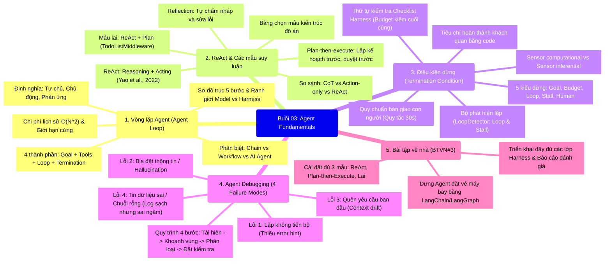
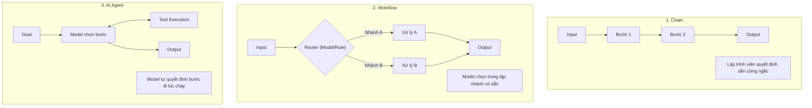
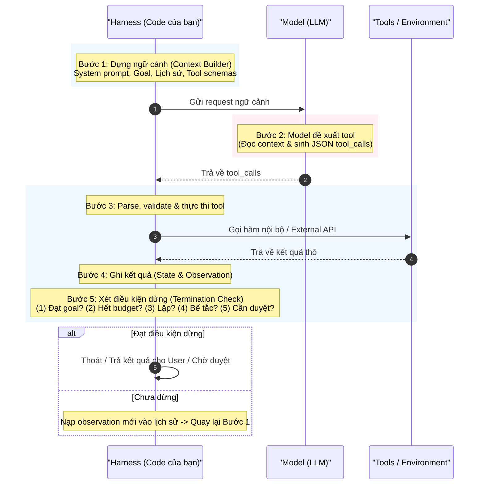
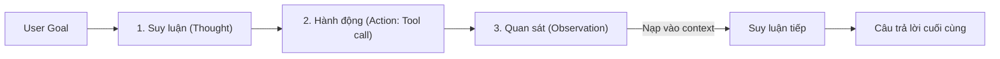
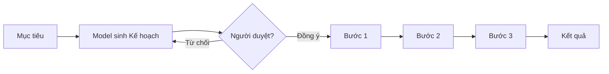
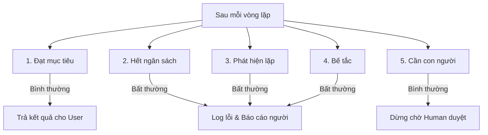
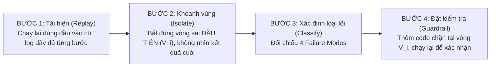

# Buổi 03: Agent Fundamentals (Kỹ thuật xây dựng hệ thống Agentic AI)

Tài liệu tổng hợp và diễn giải chi tiết toàn bộ nội dung bài giảng lý thuyết & thực hành **Buổi 03: Agent Fundamentals** thuộc môn học **SE373 - Khoa Công Nghệ Phần Mềm, Trường ĐH Công Nghệ Thông Tin (UIT - ĐHQG-HCM)**.

---

## 🗺️ Bản đồ tổng quan bài giảng (Mindmap)



---

## PHẦN 1: VÒNG LẶP AGENT (AGENT LOOP) & CẤU TRÚC NỀN TẢNG

### 1. Agent là gì?
**Agent** là phần mềm có khả năng **tự chủ hoạt động**, đưa ra quyết định để đạt được một mục tiêu cụ thể mà không cần sự can thiệp liên tục của con người.

Agent sở hữu 3 đặc tính cốt lõi:
1. **Tự chủ (Autonomous):** Tự quản lý và quyết định bước đi tiếp theo dựa trên diễn biến thực tế.
2. **Chủ động (Proactive):** Tự lên kế hoạch và khởi xướng hành động hướng tới mục tiêu.
3. **Phản ứng (Reactive):** Nhận thức môi trường thông qua kết quả công cụ và thích ứng kịp thời.

> **Ví dụ điển hình:** Người dùng yêu cầu *"Tìm vé máy bay"* $\rightarrow$ Agent kiểm tra chuyến đầu tiên nhưng hết chỗ $\rightarrow$ Agent tự phân tích kết quả và chủ động tìm chuyến bay khác thay vì dừng lại hỏi người dùng.

---

### 2. Cấu tạo: 4 thành phần tối thiểu của một Agent
Một hệ thống AI Agent hoàn chỉnh bắt buộc phải cấu thành từ 4 yếu tố:

$$\mathbf{Agent = Goal + Tools + Loop + Termination}$$

| Thành phần | Vai trò kỹ thuật | Lưu ý quan trọng |
| :--- | :--- | :--- |
| **01. Goal** | Mô tả trạng thái mục tiêu cần đạt. | Phải là **trạng thái đích**, không phải danh sách bước tĩnh. |
| **02. Tools** | Các hàm bên ngoài mà model có thể gọi qua giao thức Function Calling. | Có tên, mô tả và tham số chuẩn hóa. Không có tool, LLM chỉ là bộ sinh văn bản thuần túy. |
| **03. Loop** | Chu trình nạp kết quả của hành động trước làm đầu vào cho suy luận tiếp theo. | *Gọi tool 1 lần chưa phải là agent.* Phải có chu trình phản hồi liên tục. |
| **04. Termination** | Cơ chế quyết định dừng hay chạy tiếp (điều kiện thành công + giới hạn cứng). | **Thiếu Termination là nguyên nhân tốn kém và nguy hiểm nhất** (gây lặp vô tận, cạn kiệt ngân sách). |

---

### 3. Phân loại: Chain vs Workflow vs AI Agent
Điểm mấu chốt để phân loại nằm ở câu hỏi: **"Bước tiếp theo do ai quyết định?"**



---

### 4. Sơ đồ trục vòng lặp AI Agent & Ranh giới Model vs Harness

Một hiểu lầm phổ biến là nghĩ rằng toàn bộ Agent do LLM vận hành. Thực tế, **chỉ có duy nhất 1 bước thuộc về LLM, 4 bước còn lại hoàn toàn là mã nguồn của bạn (Harness code)**:



---

### 5. Dữ liệu State & Chuẩn hóa Observation
* **Tool Call là State:** Cần dùng `id` duy nhất (`tool_call_id`) để ánh xạ chính xác giữa lời gọi của `AIMessage` và kết quả từ `ToolMessage`.
* **Chuẩn hóa Observation (Dữ liệu trả về cho Model):**
  * ❌ **Kém:** Ném toàn bộ HTML raw hay chuỗi văn bản dài dòng hỗn tạp vào context.
  * ✅ **Tốt:** Lọc sạch và đóng gói thành JSON có cấu trúc tinh gọn (ví dụ: `{"town": "Nha Trang", "weather": "nắng", "temp": 31}`). Giúp LLM tiết kiệm token và tránh bị phân tâm (distraction).

---

### 6. Chi phí của lịch sử & Giới hạn cứng (Hard Limits)

#### Quy luật chi phí tăng theo lũy thừa bậc hai $O(N^2)$:
* Sau mỗi vòng lặp, toàn bộ lịch sử (System prompt + Các lượt gọi tool trước + Observations) đều phải được gửi lại vào Context Window.
* Nếu gọi $N$ vòng, lượng token xử lý tăng theo cấp số cộng $\rightarrow$ **Tổng chi phí tăng theo bình phương số vòng lặp ($O(N^2)$)**.
* **Quy tắc thực nghiệm:** Gấp đôi số vòng lặp $\rightarrow$ Chi phí tăng gấp ~4 lần!

```
Vòng 1: [Prompt] -> 3,000 tokens
Vòng 2: [Prompt + Turn 1] -> 6,500 tokens
Vòng 3: [Prompt + Turn 1 + Turn 2] -> 10,500 tokens
...
Vòng 8: -> 38,000 tokens!
```

#### Bốn giới hạn cứng (Ngân sách vòng lặp) bắt buộc phải cài đặt trong Harness:
1. **Bước (Step Limit):** Giới hạn tối đa số vòng lặp (vd: max 10-15 vòng).
2. **Token (Token Budget):** Giới hạn tổng số token tích lũy cho cả phiên.
3. **Thời gian (Timeout):** Giới hạn thời gian chạy tối đa (vd: 60s - 120s).
4. **Chi phí (Cost Ceiling):** Trần chi phí tài chính cho mỗi tác vụ (vd: tối đa 0.05$).

---

## PHẦN 2: REACT VÀ CÁC MẪU SUY LUẬN (REASONING PATTERNS)

### 1. Mẫu suy luận ReAct (Reasoning + Acting)
Được đề xuất bởi Yao và cộng sự (2022). ReAct là kiến trúc tổ chức suy luận:
$$\text{Reasoning (Suy luận)} \longrightarrow \text{Acting (Hành động / Tool)} \longrightarrow \text{Observation (Quan sát kết quả)} \longrightarrow \text{Lặp lại}$$



#### So sánh 3 cách tổ chức suy luận:
* **Chain of Thought (CoT):** Suy luận nhiều bước nội tại nhưng **không tương tác môi trường ngoài** (chỉ dựa vào trí nhớ đóng băng của model).
* **Action Only:** Gọi tool liên tục mà **không có bước suy luận tường minh** (hành động mù quáng, dễ lạc hướng).
* **ReAct:** Kết hợp cả hai: Dữ kiện thực tế từ môi trường được đưa vào giữa chuỗi tư duy, cho phép mô hình tự điều chỉnh chiến lược sau mỗi kết quả quan sát.

---

### 2. Mẫu kế hoạch: Plan-then-Execute
* **Cơ chế:** Gọi LLM mạnh 1 lần đầu tiên để sinh ra toàn bộ kế hoạch tổng thể (Plan: Bước 1, Bước 2, Bước 3,...). Sau đó chuyển giao cho một Execution Engine (hoặc mô hình nhỏ hơn, rẻ hơn) thực thi tuần tự từng bước.
* **Human-in-the-loop:** Kế hoạch có thể hiển thị cho người dùng phê duyệt trước khi tốn tài nguyên chạy thật.



#### Đánh đổi (Pros & Cons):
* **Ưu điểm (Pros):** Giữ vững định hướng xuyên suốt tác vụ dài; tối ưu chi phí (có thể dùng LLM nhỏ/nhanh để chạy các bước con); dễ thực thi song song các bước độc lập; kiểm soát được chi phí trước khi chạy.
* **Nhược điểm (Cons):** Kém linh hoạt khi môi trường thay đổi đột ngột; một bước trung gian bị fail sẽ kéo sập toàn bộ các bước phía sau; tốn thời gian lập kế hoạch ban đầu.
* **Bản chất:** Đánh đổi giữa **Khả năng kiểm soát/Duyệt trước** và **Khả năng thích ứng tức thời**.

---

### 3. Mẫu lai: "ReAct + Plan" (Dynamic Re-planning)
* Lập kế hoạch tổng thể $\rightarrow$ Thực thi $k$ bước theo kiểu ReAct $\rightarrow$ Đánh giá: *"Observation có làm thay đổi bài toán đáng kể không?"*
  * Nếu **Có**: Lập lại kế hoạch (Re-plan).
  * Nếu **Không**: Tiếp tục thực thi bước tiếp theo.
* Được hỗ trợ trong LangChain thông qua pattern danh sách việc cần làm (`TodoListMiddleware`).

---

### 4. Mẫu tự phản tỉnh: Reflection
* Cho phép Agent tự đánh giá, chấm điểm và sửa lỗi kết quả của chính mình trước khi bàn giao cho người dùng.
* **Quy trình:** Nhiệm vụ $\rightarrow$ LLM sinh bản nháp $\rightarrow$ LLM đóng vai giám khảo (soi và chấm theo tiêu chí: tính chính xác, logic, văn phong) $\rightarrow$ Nếu chưa đạt $\rightarrow$ phản hồi góp ý để sinh lại $\rightarrow$ Chỉ xuất bản khi đã đạt chuẩn.
* **Đặc điểm:** Tăng vọt chất lượng đầu ra, nhưng làm tăng gấp đôi hoặc gấp ba chi phí token.

---

### 5. Bảng ma trận lựa chọn mẫu kiến trúc

| Mẫu kiến trúc | Khi nào nên chọn? | Rủi ro chính |
| :--- | :--- | :--- |
| **ReAct** | Tác vụ mở, không đoán trước được số bước và đường đi. | Dễ rơi vào lặp vô hạn, trôi dạt mục tiêu (goal drift). |
| **Plan-then-Execute** | Tác vụ rõ ràng, cần phê duyệt chi phí/an toàn trước khi chạy. | Kế hoạch bị lỗi thời nếu bước đầu gặp lỗi bất ngờ. |
| **Mẫu Lai (Hybrid)** | Tác vụ dài hạn, phức tạp, môi trường có biến động dữ liệu. | Kiến trúc phức tạp, khó debug trace log. |
| **Reflection** | Cần chất lượng output cực cao, có tiêu chí kiểm chứng rõ ràng. | Chi phí token và thời gian phản hồi nhân lên gấp nhiều lần. |

---

### 6. Cú pháp khởi tạo Agent chuẩn trong LangChain 1.0 (2025/2026)

```python
from langchain.agents import create_agent
from langchain.agents.middleware import ModelCallLimitMiddleware

agent = create_agent(
    model=os.environ["SE373_MODEL"],
    tools=TOOLS,
    system_prompt="Chỉ dùng tool để lấy thông tin, kể cả tên điểm đến.",
    middleware=[ModelCallLimitMiddleware(run_limit=8, exit_behavior="end")],
)

result = agent.invoke({"messages": [{"role": "user", "content": CAU_HOI}]})
```

> ⚠️ **Quy tắc vàng: "Có Tool chưa chắc Model sẽ dùng Tool!"**
> Nếu không có `system_prompt` nghiêm ngặt cưỡng chế model dùng tool, mô hình thường có xu hướng "tự tin thái quá" và tự lấy dữ liệu từ trí nhớ huấn luyện cũ (vốn đã lỗi thời) thay vì gọi công cụ.

---

## PHẦN 3: ĐIỀU KIỆN DỪNG (TERMINATION CONDITIONS)

### 1. Định nghĩa Termination Condition
**Termination Condition** là tập hợp các tiêu chí lập trình khách quan để Agent kết thúc vòng lặp khi **đạt được mục tiêu** hoặc **chạm đến giới hạn an toàn**.

> 🚨 **Cạm bẫy mặc định của các Framework (LangChain, LangGraph):**
> Framework mặc định chỉ dừng khi *Model tự quyết định không gọi tool nữa*. Nếu model bị ảo giác, bị lỗi lặp, hoặc không biết làm gì tiếp, nó sẽ chạy cho đến khi sập quota hoặc cạn tiền!

---

### 2. Năm kiểu dừng trong Agent Loop



| STT | Kiểu dừng | Bản chất | Loại |
| :---: | :--- | :--- | :---: |
| **1** | **Đạt mục tiêu (Goal)** | Model thôi gọi tool vì nhiệm vụ đã hoàn thành. *Nguy hiểm nhất khi sai vì nó trông rất giống thành công!* Bắt buộc phải có code kiểm chứng. | Bình thường |
| **2** | **Hết ngân sách (Budget)** | Harness đếm thấy chạm trần số bước, token, thời gian hoặc chi phí. Không phụ thuộc model. | Bất thường |
| **3** | **Phát hiện lặp (Loop)** | Gọi lại cùng một tool với cùng tham số liên tiếp mà không có tiến triển. | Bất thường |
| **4** | **Bế tắc (Stall)** | Agent đổi tool liên tục qua nhiều vòng nhưng đại lượng đo tiến triển của bài toán vẫn đứng yên. | Bất thường |
| **5** | **Cần con người (Approval)** | Model chuẩn bị gọi một hành động nhạy cảm vượt thẩm quyền (xóa DB, chuyển tiền, mua vé không hoàn). | Bình thường |

---

### 3. Thứ tự kiểm tra Checklist Harness (Checklist Pipeline)

Thứ tự kiểm tra trong mã nguồn Harness sau mỗi vòng lặp mang tính quyết định sống còn:

| Thứ tự | Thời điểm kiểm tra | Đại lượng kiểm tra | Kiểu dừng kích hoạt |
| :---: | :--- | :--- | :--- |
| **#0** | **Trước khi thực thi tool** | Quyền hạn của hành động chuẩn bị thực hiện. | **Cần con người** (Approval) |
| **#1** | Sau khi nhận Observation | Tiêu chí hoàn thành (Logic code, DB, HTTP status). | **Đạt mục tiêu** (Success) |
| **#2** | Sau khi nhận Observation | Cặp `(tool, args)` có trùng với các vòng gần đây? | **Phát hiện lặp** (Loop) |
| **#3** | Sau khi nhận Observation | Đại lượng đo mức độ tiến triển có tăng lên không? | **Bế tắc** (Stall) |
| **#4** | Sau khi nhận Observation | Số vòng lặp, Token tích lũy, Thời gian, Số tiền. | **Hết ngân sách** (Budget) |

> ⚠️ **NGUYÊN TẮC VÀNG:** **Kiểm tra Ngân sách (Budget) LUÔN ĐẶT Ở CUỐI CÙNG!**
> Nếu bạn đặt kiểm tra ngân sách lên đầu tiên, mọi vòng lặp bị lỗi (lặp vô tận, bế tắc) đều sẽ bị gộp chung thành nhãn *"Hết ngân sách"*, khiến bạn mất hoàn toàn khả năng chẩn đoán nguyên nhân gốc rễ (Root Cause Analysis).

---

### 4. Cơ chế đo: Sensor Computational vs Sensor Inferential

* **Sensor Computational (Ưu tiên số 1):**
  * Sử dụng test case, linter, type checker, schema validation, HTTP status code.
  * Tính chất: Xác định (deterministic), thực thi trong mili-giây, **hoàn toàn 0 tốn token**.
* **Sensor Inferential:**
  * Dùng một mô hình LLM khác (LLM-as-a-judge) để chấm điểm câu trả lời.
  * Tính chất: Không hoàn toàn xác định, tốn thêm chi phí và độ trễ. Chỉ dùng khi không thể đo đạc bằng máy móc (đánh giá phong cách viết, sự đồng cảm).

---

### 5. Bốn dạng tiêu chí kiểm chứng khách quan (Completion Criteria)
Tuyệt đối không tin vào lời tuyên bố chủ quan của model (vd: *"Tôi đã hoàn thành xong tác vụ"*). Phải kiểm chứng bằng 1 trong 4 dạng:
1. **Vị từ chạy bằng code (Code Predicates):** `pytest exit code == 0`, `HTTP 200`, `booking.status == "confirmed" and booking.paid == True`.
2. **Schema hợp lệ:** Dữ liệu đầu ra ép parse thành công qua Pydantic model (`BookingSchema`).
3. **Kiểm chứng chéo (Cross-verification):** Nếu Agent nói *"Đã tạo Issue trên GitHub"*, Harness tự gọi API GitHub GET issue về xem có thật không.
4. **Người duyệt (Human-in-the-loop):** Áp dụng cho các giao dịch nhạy cảm không thể tự động hóa 100%.

---

### 6. Cài đặt Bộ phát hiện lặp (LoopDetector)

Bộ phát hiện lặp **không có sẵn trong framework**, kỹ sư Agentic AI bắt buộc phải tự viết code:

```python
from collections import deque

class LoopDetector:
    def __init__(self, window=6, repeat_k=2, stall_n=5):
        self.recent = deque(maxlen=window)  # Chỉ so sánh trong cửa sổ trượt gần
        self.k = repeat_k
        self.n = stall_n
        self.last = None
        self.stall = 0

    def check(self, tool: str, args: dict, progress: any):
        # 1. Phát hiện lặp Action: Trùng (tool, args)
        fp = (tool, repr(sorted(args.items())))
        if self.recent.count(fp) + 1 >= self.k:
            return "LOOP"
        self.recent.append(fp)

        # 2. Phát hiện Bế tắc: Đại lượng tiến triển không đổi qua n vòng liên tiếp
        self.stall = self.stall + 1 if progress == self.last else 0
        self.last = progress
        if self.stall >= self.n:
            return "STALL"

        return None
```

> **Lưu ý kỹ thuật:** Khi kiểm tra trùng lặp, **chỉ so sánh `(tool, args)` mà KHÔNG so sánh `observation`**. Vì hành động gọi lại cùng 1 tool để chờ trạng thái (Polling, ví dụ: kiểm tra thanh toán `get_booking_status`) là hoàn toàn hợp lệ.

---

### 7. Tiêu chuẩn Bàn giao cho con người (Human Handoff)

> **"Bàn giao tốt là bàn giao mà người nhận có thể đưa ra quyết định trả lời trong vòng 30 giây."**

Báo cáo bàn giao (handoff context) phải tóm lược đúng 3 thành phần:
1. **Trạng thái hiện tại:** Đã làm tới đâu? Hành động nào đã gây ra side-effect (tác dụng phụ)?
2. **Những gì đã thử:** Đã đi qua những nhánh nào, vì sao thất bại?
3. **Câu hỏi cụ thể:** Đưa ra câu hỏi nhị phân hoặc lựa chọn rõ ràng (Ví dụ: *"Dùng bảng orders cũ hay orders_v2?"*, *"Vé có giá 1.950.000đ vượt hạn mức 1.500.000đ, bạn có đồng ý chi không?"*).

---

## PHẦN 4: AGENT DEBUGGING (4 FAILURE MODES THƯỜNG GẶP)

Agent Debugging là kỹ năng quan trọng và thử thách nhất đối với một kỹ sư Agentic AI.

### 1. Quy trình 4 bước Debug Agent chuẩn



---

### 2. Bảng tra 4 Failure Modes kinh điển

```
+---------------------------------------------------------------------------------------------------+
| FAILURE MODE 1: LẶP KHÔNG TIẾN BỘ        | FAILURE MODE 2: BỊA ĐẶT THÔNG TIN (HALLUCINATION)      |
| - Dấu hiệu: Gọi 1 tool lặp đi lặp lại.   | - Dấu hiệu: Bịa ID, giá tiền, ngày tháng không có thật |
| - Nguyên nhân: Tool trả lỗi mơ hồ.       | - Nguyên nhân: Model tự chế dữ liệu khi thiếu context  |
| - Giải pháp: Tool phải trả Hint & JSON.  | - Giải pháp: Validate Pydantic & Đối chiếu với Tool.   |
|------------------------------------------+--------------------------------------------------------|
| FAILURE MODE 3: QUÊN YÊU CẦU GỐC         | FAILURE MODE 4: TIN VÀO DỮ LIỆU SAI (SUBTLE BUG)       |
| - Dấu hiệu: Lạc đề sau nhiều lượt gọi.   | - Dấu hiệu: Log sạch bóng nhưng kết luận sai từ đầu.   |
| - Nguyên nhân: Context rot, lùi xa gốc.  | - Nguyên nhân: Tool trả chuỗi rỗng '' khiến model suy diễn |
| - Giải pháp: Lưu ràng buộc thành dữ liệu | - Giải pháp: Ép tool trả status & metadata chi tiết.   |
+---------------------------------------------------------------------------------------------------+
```

---

### Chi tiết từng Failure Mode & Kỹ thuật khắc phục:

#### Vấn đề 01: Lặp lại nhưng không tiến bộ (Looping without progress)
* **Tình huống:** Người dùng hỏi thời tiết Vũng Tàu. Model gọi `weather_forecast(town="Vung Tau")` $\rightarrow$ Tool trả `{"error": "not found"}`. Model thử đổi tên thành `"Vũng Tàu"`, `"Vung Tau City"`... và lặp lại suốt 35 vòng cho đến khi chạm trần ngân sách.
* **Nguyên nhân gốc:** Công cụ chỉ báo lỗi chung chung mà không chỉ dẫn cho model biết cách sửa sai.
* **Cách khắc phục:** Cải tiến Tool trả về mã lỗi rõ ràng kèm **gợi ý (hint)**:
  ```json
  {
    "status": "invalid_town",
    "hint": "Gọi list_supported_towns() để lấy danh sách các điểm đến hợp lệ",
    "supported_count": 63
  }
  ```

#### Vấn đề 02: Bịa đặt thông tin (Hallucination)
* **Tình huống:** Hỏi tình trạng và tổng tiền đơn hàng. Tool `get_order` và `get_tracking` chỉ trả về thông tin trạng thái kho bãi (chưa có trường tiền tệ). Model tự ý sinh ra: *"Tổng tiền 1.250.000đ, phí ship 30.000đ, thanh toán VISA đuôi 4412"*. Chương trình không hề báo lỗi nhưng dữ liệu bịa đặt 100%!
* **Nguyên nhân gốc:** Model chịu áp lực phải trả lời đủ câu hỏi của người dùng dù thiếu dữ liệu.
* **Cách khắc phục:**
  1. Giới hạn danh sách tool được gọi.
  2. Validate tham số tool qua Pydantic.
  3. **Đối chiếu câu trả lời cuối với dữ liệu thực tế từ Tool (Fact Checking / Grounding):** Bóc tách các thực thể số, ngày tháng, ID trong câu trả lời cuối và kiểm tra xem có xuất hiện trong Tool Observation không.

#### Vấn đề 03: Quên yêu cầu ban đầu (Context Drift / Requirement Amnesia)
* **Tình huống:** Yêu cầu: *"Tìm vé TP.HCM -> Đà Nẵng sáng thứ Năm, dưới 2 triệu"*. Vòng 2 tìm thấy vé 2.310.000đ (quá giá). Vòng 3-4 model quay sang gọi tool xem review các hãng bay. Đến vòng 6, model trả lời: *"Đề xuất chuyến chiều thứ Sáu, giá 2.400.000đ vì hãng được đánh giá tốt hơn"*.
* **Nguyên nhân gốc:** Khi lịch sử trò chuyện ngày càng dài, yêu cầu gốc bị trôi xa (Lost in the middle / Context rot).
* **Cách khắc phục:** Đóng băng yêu cầu và ràng buộc thành dữ liệu có cấu trúc (`yeu_cau = {"ngay": "07/10", "buoi": "sang", "tran_gia": 2_000_000}`). Trước khi trả lời người dùng, Harness bắt buộc chạy hàm kiểm tra: `check_constraints(ve_duoc_chon, yeu_cau)`.

#### Vấn đề 04: Tin vào dữ liệu sai (Gullible Agent - Lỗi ngầm nguy hiểm nhất)
* **Tình huống:** Kiểm tra lỗi hệ thống: `search_logs(service="payment", level="ERROR")`. Tool trả về chuỗi rỗng `""`. Model vội vàng kết luận: *"Không có log lỗi nào, hệ thống an toàn, không cần rollback!"*. Nhưng thực tế là do lập trình viên truyền sai tên trường nên tool không lọc được log.
* **Nguyên nhân gốc:** Tool trả về chuỗi rỗng mơ hồ khiến model tự suy diễn rằng hệ thống không có lỗi. Log chạy hoàn toàn "sạch sẽ", không exception, dẫn đến bug ngầm tai hại.
* **Cách khắc phục:** Tuyệt đối không để Tool trả về chuỗi rỗng. Luôn định dạng kết quả trả về dưới dạng JSON có trạng thái tường minh:
  ```json
  {"status": "ok", "matched": 0, "logs": []}
  // hoặc nếu gọi sai cú pháp:
  {"status": "invalid_param", "param": "level", "allowed": ["error", "warn", "info"]}
  ```

---

## PHẦN 5: BÀI TẬP VỀ NHÀ (BTVN#3)

### Yêu cầu đề bài BTVN#3: "Dựng Agent Đặt Vé Máy Bay bằng LangChain"
Xây dựng một hệ thống Agent hoàn chỉnh giải quyết bài toán đặt vé máy bay theo đúng tiêu chuẩn kỹ thuật Agentic AI.

#### 3 Nhiệm vụ cốt lõi:
1. **Thiết kế đầy đủ các lớp Harness:**
   * Lưu ràng buộc bài toán dưới dạng dữ liệu có cấu trúc.
   * Cài đặt tiêu chí hoàn thành kiểm chứng được bằng code (không dựa vào lời model).
   * Cài đặt cơ chế kiểm quyền hành động nhạy cảm (Human Approval) và bàn giao (Handoff 30s).
   * Cài đặt bộ phát hiện lặp (`LoopDetector`) và giới hạn cứng ngân sách (Budget).
2. **Cài đặt Agent với 3 mẫu thiết kế (Design Patterns):**
   * Mẫu 1: **ReAct** (Vòng lặp Suy luận - Hành động - Quan sát linh hoạt).
   * Mẫu 2: **Plan-then-Execute** (Lập kế hoạch trước, duyệt trước, thực thi tuần tự).
   * Mẫu 3: **Mẫu Lai (Hybrid)** (Lập kế hoạch động, Re-plan khi có observation bất thường).
3. **Đánh giá và so sánh thực nghiệm:**
   * So sánh hiệu quả của cả 3 mẫu thiết kế trên cùng một bộ test case đầu vào.
   * Đánh giá dựa trên: Số vòng lặp, Lượng token tiêu thụ, Tỷ lệ thành công, Khả năng ứng phó khi có ngoại lệ/hết chuyến bay.
   * **Sản phẩm nộp:** Mã nguồn Python (`.py`) hoàn chỉnh kèm Báo cáo đánh giá chi tiết (`.md` / `.pdf`).

> 📌 **LƯU Ý THEO QUY TẮC WORKSPACE ([.agents/MAIN.md](file:///home/phandinhminh/Downloads/AGENTIC-AI/.agents/MAIN.md)):**
> Khi bắt đầu triển khai code cho BTVN#3 trong thư mục `homeworks/Buoi 03. Agent Fundamentals`, luôn luôn tạo một môi trường ảo (`venv`) độc lập và file `requirements.txt` riêng biệt cho project.

---

## 📌 Bảng Cheatsheet & Tóm tắt Quy tắc vàng Buổi 03

| Thuật ngữ / Quy tắc | Nội dung kỹ thuật cốt lõi |
| :--- | :--- |
| **Công thức Agent** | $\mathbf{Agent = Goal + Tools + Loop + Termination}$. Thiếu Termination là tốn kém nhất. |
| **Ranh giới Harness** | Chỉ duy nhất bước *Model đề xuất tool* là của LLM. Dựng context, parse tool, ghi state, xét dừng là code của bạn. |
| **Chi phí $O(N^2)$** | Chi phí token tăng theo bình phương số vòng lặp do phải nạp lại toàn bộ lịch sử. |
| **Checklist dừng** | **Budget kiểm tra cuối cùng!** Kiểm quyền (#0) $\rightarrow$ Hoàn thành (#1) $\rightarrow$ Lặp (#2) $\rightarrow$ Bế tắc (#3) $\rightarrow$ Ngân sách (#4). |
| **Sensor Computational** | Ưu tiên số 1: Code assertion, HTTP status, schema pydantic (chính xác, 0 token). |
| **Phát hiện Lặp** | So sánh `(tool, args)` trong sliding window; đo biến `progress` để phát hiện bế tắc (Stall). |
| **Quy tắc Bàn giao** | Bàn giao tốt là bàn giao mà con người có thể trả lời đưa ra quyết định trong vòng **30 giây**. |
| **Debug Failure Modes** | 4 lỗi: Lặp không tiến bộ, Hallucination, Quên yêu cầu ban đầu, Tin vào dữ liệu sai (chuỗi rỗng). |
